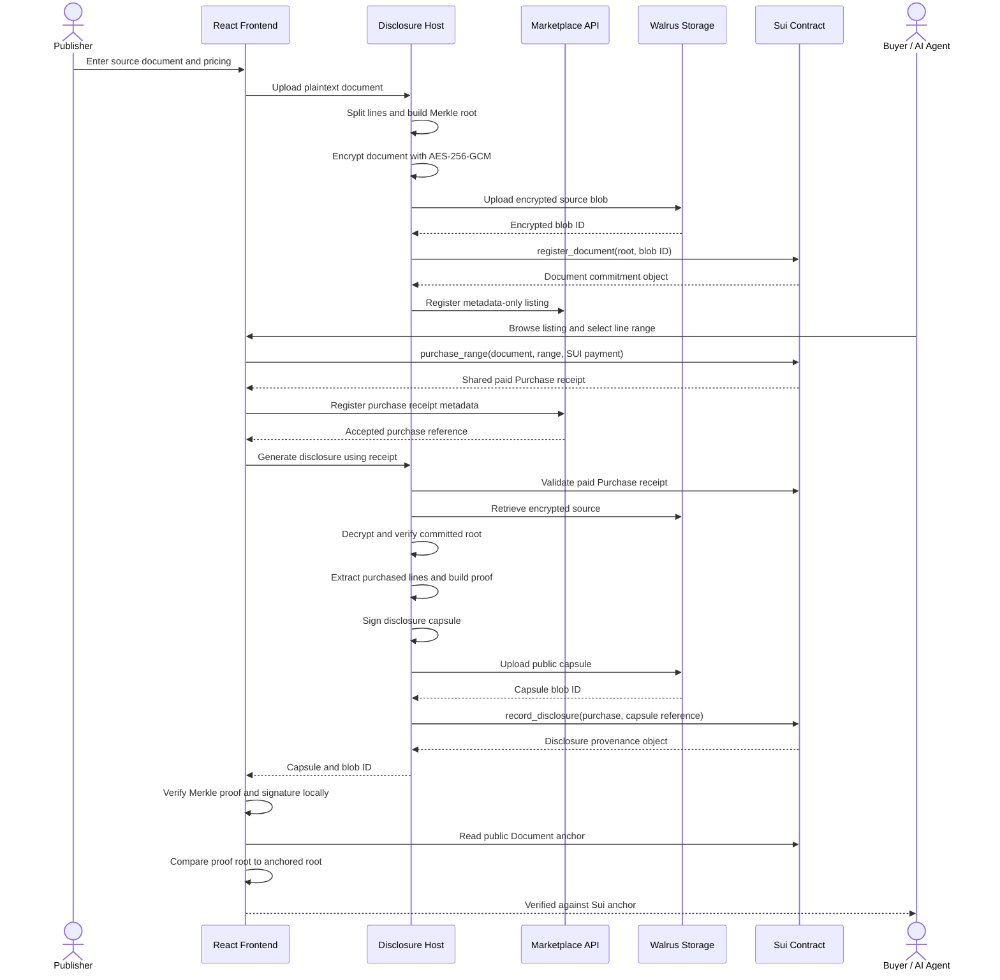

# Capsule 

> Walrus-native selective disclosure for verifiable AI knowledge exchange.

**Capsule** is a protocol and marketplace demo
built for the Walrus track of Sui Overflow 2026. Publishers encrypt documents,
commit their line-level Merkle roots on Sui, and disclose only purchased
fragments. Buyers and AI agents receive durable Walrus capsules containing the
disclosed lines, proof material, and provenance needed to verify those lines
without receiving the full source document.

## Why Capsule

Private datasets are valuable because they are not public, but useful knowledge
often lives in a small excerpt. Capsule makes a document independently
verifiable without making it wholly visible:

- **Selective disclosure:** buyers receive only the purchased line range.
- **Verifiable content:** SHA-256 Merkle proofs tie each disclosed line to the
  committed original document.
- **Durable artifacts:** encrypted source envelopes and public disclosure
  capsules are stored on Walrus.
- **Public provenance:** Sui stores document commitments and disclosure
  records.
- **Agent-ready output:** capsules are stable JSON artifacts suitable for
  verified retrieval and AI workflows.

## Live Testnet Validation

The current build has completed a real synthetic end-to-end run against Walrus
testnet and Sui testnet:

| Item | Public identifier |
| --- | --- |
| Sui Move package | `0xf71a6439bfe12645e47713e824b0c1f43f112ee187ed3510f4c155a10c01ba4d` |
| Package publish transaction | `6KiCJCnMGp5fyBxo3Tq83VQ1fwzZCc27xVnVEwqhH17a` |
| Anchored Document object | `0x19ac994787ee5d97f6c5777b3a841c9c08ea1fe1110b32da637d109c622c2b1d` |
| Paid Purchase object | `0xbe4cb2bd02e9c5abc27344c0e44cee0d67f1dd6f79b6138b1d8d672e6a99513b` |
| Payment transaction | `Hbe8Ly6XHppAYxicRBikuYFMcfGMUdefvBCo8a9bXvcG` |
| Recorded Disclosure object | `0x16bcf76f62f5aa3d85777a37cbca8feb2087298a1d144b1fcfe554fc38800e88` |
| Encrypted source Walrus blob | `yGhgDDaqfqo7SMMGnB_VOni1RVKuiIJLQAOmOSfMGJI` |
| Disclosure capsule Walrus blob | `jGYfs8xE6f6PHozmvJey6QTQiMhM3IiObLFqo9ShZZc` |

The capsule was retrieved from Walrus and verified against its Sui-anchored
root by the API after a real `1,000,000` MIST purchase receipt was created and
consumed on Sui. The recorded `Disclosure` stores the paid `Purchase` ID for
direct provenance inspection. Full public artifacts are recorded in
[`docs/testnet-validation.md`](docs/testnet-validation.md) and
[`deployments/sui-testnet.json`](deployments/sui-testnet.json).

## Product Workflow



### Publisher Flow

1. A publisher enters a line-oriented dataset and per-line price.
2. The disclosure host computes the deterministic Merkle root and encrypts the
   full source using AES-256-GCM.
3. Only the encrypted source envelope is published to Walrus.
4. The root and Walrus blob reference are anchored in a Sui `Document` object.
5. The marketplace stores public listing metadata, never raw source content.

### Buyer Or Agent Flow

1. A connected buyer selects a line range and signs an exact-price SUI
   payment that creates a public, one-use `Purchase` receipt.
2. The disclosure host validates that receipt, reads and decrypts the source, checks it against the
   committed root, and creates a proof for only the purchased lines.
3. A signed disclosure capsule is uploaded to Walrus and recorded on Sui.
4. The browser independently verifies the capsule proof and resolves the Sui
   document anchor before accepting the revealed content.

## Capsule Artifact

A public disclosure capsule is an immutable, replayable knowledge fragment:

```json
{
  "documentBlobId": "walrus-encrypted-source-blob",
  "suiDocumentId": "0x...",
  "rootHash": "sha256-merkle-root",
  "lineRange": { "start": 199, "end": 249 },
  "disclosedContent": ["..."],
  "proof": {},
  "paymentTx": "sui-payment-transaction-digest",
  "suiPurchaseId": "0x...",
  "signature": "..."
}
```

The original plaintext document and its AES key are not included in the
capsule.

## Architecture

| Layer | Implementation | Responsibility |
| --- | --- | --- |
| Interface | React, Vite, Tailwind, TanStack Query, Zustand | Upload, browse, issue capsules, verify |
| Marketplace API | Express, TypeScript | Listings, prices, purchase receipts, public metadata |
| Disclosure Host | Express, TypeScript | Encryption, selective release, signatures, storage and Sui submission |
| Proof SDK | TypeScript | Browser/node Merkle and capsule verification |
| Proof Engine | Rust, WASM | Canonical Merkle operations and WASM exports |
| Storage | Walrus | Encrypted documents and public disclosure capsules |
| Commitments | Sui Move | Document roots and disclosure provenance |

### Monorepo

| Path | Purpose |
| --- | --- |
| `apps/frontend` | Publisher, buyer, and verification experience |
| `apps/marketplace-api` | Listing, pricing, purchase, and metadata API |
| `apps/disclosure-host` | Encryption, proof generation, Walrus, and Sui host |
| `packages/shared-types` | Protocol types shared across services |
| `packages/sdk-typescript` | Browser/node verification and client SDK |
| `packages/proof-engine-rust` | Rust Merkle implementation with WASM exports |
| `packages/sui-contracts` | Move document and disclosure objects |

## Security Model And MVP Boundary

Walrus is public storage. Capsule therefore uploads the original source only
after AES-256-GCM encryption; disclosure capsules are intentionally public
because they contain purchased material intended for durable audit and reuse.

The live testnet implementation currently proves:

- encrypted source publication on Walrus;
- permanent capsule publication on Walrus;
- Sui document-root anchoring and disclosure provenance;
- local proof, signature, and on-chain-root verification.

Testnet purchases now transfer exact-price SUI payments to the publisher and
create a one-use shared receipt that must be consumed to record disclosure.
The primary remaining trust boundary is encryption custody: the disclosure
host still holds document decryption keys in memory. Production hardening
requires Seal-compatible selective encryption or another trust-minimized key
release design, plus durable marketplace persistence and authenticated
production operations. See [`docs/roadmap.md`](docs/roadmap.md).

## Run Locally

Requirements: Node.js 20+, npm, Rust tooling for proof-engine tests, the Sui
CLI for Move builds, and `wasm-pack` for WASM builds.

```bash
cp .env.example .env
npm install
npm run dev
```

Services:

| Service | URL |
| --- | --- |
| Frontend | `http://localhost:5173` |
| Marketplace API | `http://localhost:4000` |
| Disclosure Host | `http://localhost:4001` |

In local demo mode, use `STORAGE_DRIVER=memory`. It exercises encryption,
proofs, capsules, and UI verification without publishing external artifacts.

## Run Against Testnet

Never paste a private key into source code, screenshots, chat, or a commit.
Put a funded Sui testnet `suiprivkey...` value only in the gitignored `.env`
file:

```env
PROTOCOL_MODE=testnet
STORAGE_DRIVER=walrus
SUI_NETWORK=testnet
SUI_PRIVATE_KEY=suiprivkey...
SUI_PACKAGE_ID=0xf71a6439bfe12645e47713e824b0c1f43f112ee187ed3510f4c155a10c01ba4d
VITE_SUI_NETWORK=testnet
VITE_CAPSULE_PACKAGE_ID=0xf71a6439bfe12645e47713e824b0c1f43f112ee187ed3510f4c155a10c01ba4d
```

To publish a new contract package instead of using the recorded deployment:

```bash
npm run deploy:testnet
```

Then use the printed public package ID for both `SUI_PACKAGE_ID` and
`VITE_CAPSULE_PACKAGE_ID`.

## Build And Verify

```bash
npm run check
npm run move:build
npm run wasm:node
npm run wasm:web
```

## Documentation

- [Architecture](docs/architecture.md)
- [Demo script](docs/demo.md)
- [Walrus and Sui integration](docs/integration.md)
- [Testnet validation record](docs/testnet-validation.md)
- [Upgrade roadmap](docs/roadmap.md)
