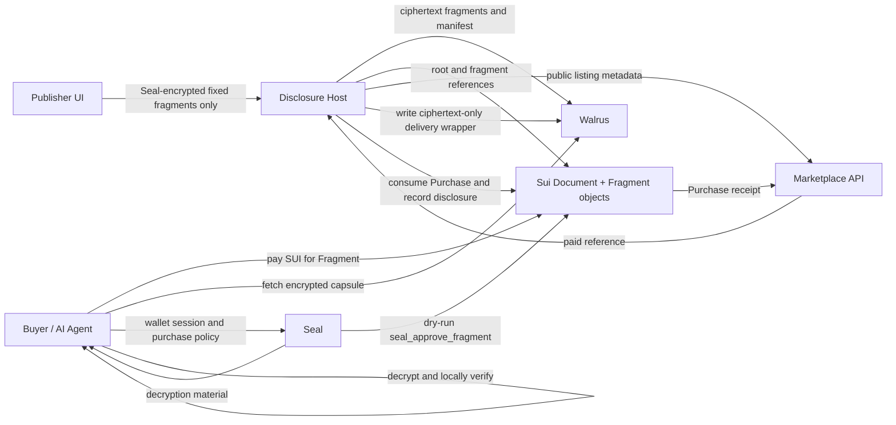

# Capsule Architecture

## Security Boundary

Walrus blobs are public. In fixed-fragment mode, Capsule chunks plaintext and
computes Merkle proofs in the publisher browser, then Seal-encrypts each
sellable section before it reaches the host. Buyers never obtain content
outside the section they paid for, and the host never holds the source key.

Payments are settled with a `Purchase` object bound to an on-chain `Fragment`.
The same object authorizes Seal decryption through read-only
`seal_approve_fragment`. A host-generated AES route remains only as a legacy
compatibility flow for arbitrary line ranges.

## Data Flow



## Merkle Commitment

In the publisher-sealed product path, lines are UTF-8 encoded and committed
with a document nonce plus per-line nonces:

```text
leaf = SHA256("capsule:salted-leaf:v1" || document_nonce || line_index || line_nonce || line_content)
```

Only the nonces for purchased lines are included in the disclosed proof. This
keeps verification local while reducing offline guessing attacks against
short, templated, or predictable document lines.

Leaves are padded to the next power of two with domain-separated padding
leaves:

```text
padding_leaf = SHA256("capsule:padding-leaf:v1" || padded_line_index)
```

Parent nodes are still `SHA256(left || right)`. Line ranges are inclusive and
zero-indexed at API boundaries; the UI labels them as human-friendly
one-indexed lines. A plain `SHA256(line)` proof path remains only for legacy
local compatibility capsules.

The TypeScript SDK provides immediate browser verification. The Rust engine
implements the same canonical algorithm and exposes WASM entry points for a
high-performance verifier.

## Services

The marketplace is intentionally blind to document content and encryption
keys. It stores publishable metadata, purchasable sections, receipts, and
non-sensitive capsule summaries. In persistent mode those records and their
latest Sui audit statuses are stored in PostgreSQL; memory mode remains
available for a zero-setup local demo.

For fixed fragments, the disclosure host does not own confidential
processing. It verifies paid metadata, stores encrypted deliveries, and
records provenance. Proof construction and encryption happen in the
publisher browser; decryption and verification happen in the buyer browser.

## Public Chain Reconciliation

The marketplace reads, but never signs for, the public Sui objects referenced
by its index. Manual or scheduled reconciliation validates:

- `Document` root, manifest blob, owner, line count, price, and registration digest;
- `Fragment` range, Seal identity, encrypted blob, and parent document;
- `Purchase` metadata, fragment binding, and the payment transaction that created its receipt;
- `Disclosure` buyer, range, purchase reference, and capsule blob.

Purchase reconciliation verifies its creation in the payment transaction
because recording a disclosure later mutates its `consumed` status. This keeps
the audit index correct after successful delivery.

## AI-Agent Interface

An authorized agent can list documents, purchase an approved range, unlock a
Seal-encrypted JSON capsule, verify it locally using the SDK or WASM proof
engine, and feed only verified content into retrieval pipelines. Capsule JSON
is deliberately stable and machine-readable after decryption.

The `apps/agent-mcp` server exposes the safe part of that flow to MCP clients:
listing documents, reading commitments, fetching capsule records, and verifying
plaintext/decrypted capsules. Purchase signing and Seal wallet authorization
remain outside the MCP server so an apparently read-only agent action cannot
quietly spend SUI or request private decryption material.
