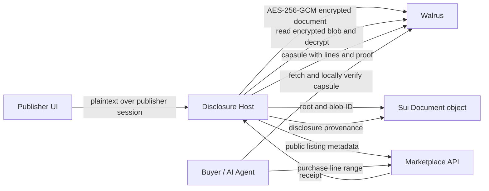

# Capsule Architecture

## Security Boundary

Walrus blobs are public. Capsule therefore chunks plaintext locally for its
Merkle commitment, encrypts the complete source with AES-256-GCM, and uploads
only the encrypted envelope. The disclosure host is the MVP key custodian:
buyers do not obtain the document key and receive only purchased plaintext
lines inside a disclosure capsule.

For a production deployment, the host key vault and purchase authorization
should be replaced with threshold key management or trusted execution backed
key release. This limitation is explicit rather than disguised as full
decentralization.

## Data Flow

## Merkle Commitment

Lines are UTF-8 encoded and leaf-hashed as `SHA256(line)`. Leaves are padded
to the next power of two with `SHA256("")`; an empty document has one empty
leaf. Parent nodes are `SHA256(left || right)`. Line ranges are inclusive and
zero-indexed at API boundaries; the UI labels them as human-friendly
one-indexed lines.

The TypeScript SDK provides immediate browser verification. The Rust engine
implements the same canonical algorithm and exposes WASM entry points for a
high-performance verifier.

## Services

The marketplace is intentionally blind to document content and encryption keys.
It stores publishable metadata, purchasable sections, and receipts.

The disclosure host owns confidential processing in the MVP. It verifies that a
receipt grants the requested range, creates a Merkle proof, packages provenance,
and uploads a capsule to storage.

## AI-Agent Interface

An agent can list documents, purchase an approved range, receive a JSON capsule,
verify it locally using the SDK or WASM proof engine, and feed only verified
content into retrieval pipelines. Capsule JSON is deliberately stable and
machine-readable.

