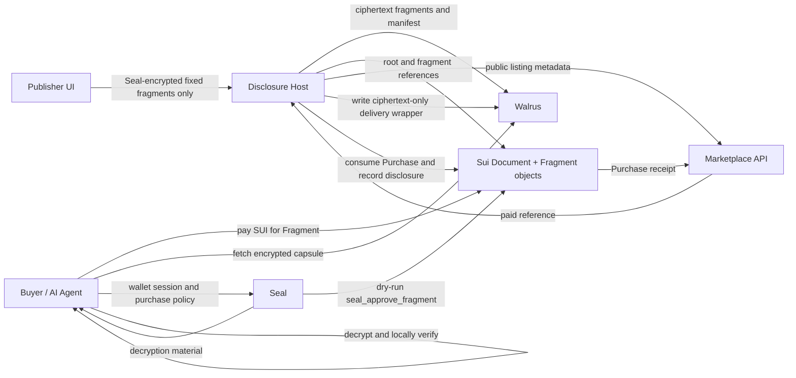

# Capsule Architecture

## Security Boundary

Walrus blobs are public. In fixed-fragment mode, Capsule chunks plaintext and
computes Merkle proofs in the publisher browser, then Seal-encrypts each
sellable section before it reaches the host. Buyers never obtain content
outside the section they paid for, and the host never holds the source key.

Payments are settled with a `Purchase` object bound to an on-chain `Fragment`.
The same object authorizes Seal decryption through read-only
`seal_approve_fragment`. A host-generated AES route remains only as a legacy
compatibility flow for arbitrary line ranges.

## Data Flow

## Merkle Commitment

Lines are UTF-8 encoded and leaf-hashed as `SHA256(line)`. Leaves are padded
to the next power of two with `SHA256("")`; an empty document has one empty
leaf. Parent nodes are `SHA256(left || right)`. Line ranges are inclusive and
zero-indexed at API boundaries; the UI labels them as human-friendly
one-indexed lines.

The TypeScript SDK provides immediate browser verification. The Rust engine
implements the same canonical algorithm and exposes WASM entry points for a
high-performance verifier.

## Services

The marketplace is intentionally blind to document content and encryption
keys. It stores publishable metadata, purchasable sections, receipts, and
non-sensitive capsule summaries.

For fixed fragments, the disclosure host does not own confidential
processing. It verifies paid metadata, stores encrypted deliveries, and
records provenance. Proof construction and encryption happen in the
publisher browser; decryption and verification happen in the buyer browser.

## AI-Agent Interface

An authorized agent can list documents, purchase an approved range, unlock a
Seal-encrypted JSON capsule, verify it locally using the SDK or WASM proof
engine, and feed only verified content into retrieval pipelines. Capsule JSON
is deliberately stable and machine-readable after decryption.
