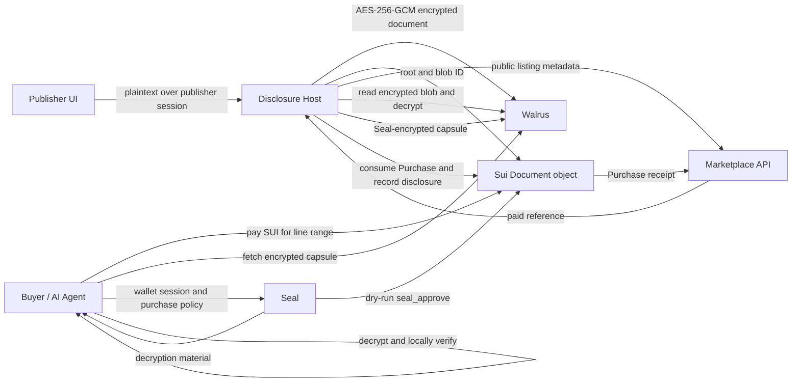

# Capsule Architecture

## Security Boundary

Walrus blobs are public. Capsule therefore chunks plaintext locally for its
Merkle commitment, encrypts the complete source with AES-256-GCM, and uploads
only the encrypted envelope. The disclosure host is still the source-key
custodian: buyers do not obtain the document key. In Seal mode, a purchased
capsule is encrypted before Walrus upload and decrypted locally by its paid
buyer.

Payments are settled with a Sui `Purchase` object consumed when disclosure is
recorded. The same purchase object authorizes Seal decryption through a
read-only `seal_approve` policy. To remove the remaining source-key boundary,
publication should produce publisher-side Seal-encrypted purchasable fragments.

## Data Flow

## Merkle Commitment

Lines are UTF-8 encoded and leaf-hashed as `SHA256(line)`. Leaves are padded
to the next power of two with `SHA256("")`; an empty document has one empty
leaf. Parent nodes are `SHA256(left || right)`. Line ranges are inclusive and
zero-indexed at API boundaries; the UI labels them as human-friendly
one-indexed lines.

The TypeScript SDK provides immediate browser verification. The Rust engine
implements the same canonical algorithm and exposes WASM entry points for a
high-performance verifier.

## Services

The marketplace is intentionally blind to document content and encryption
keys. It stores publishable metadata, purchasable sections, receipts, and
non-sensitive capsule summaries.

The disclosure host owns confidential processing in the MVP. It verifies that a
receipt grants the requested range, creates a Merkle proof, packages provenance,
and, in Seal mode, uploads only an encrypted capsule envelope to storage.

## AI-Agent Interface

An authorized agent can list documents, purchase an approved range, unlock a
Seal-encrypted JSON capsule, verify it locally using the SDK or WASM proof
engine, and feed only verified content into retrieval pipelines. Capsule JSON
is deliberately stable and machine-readable after decryption.
